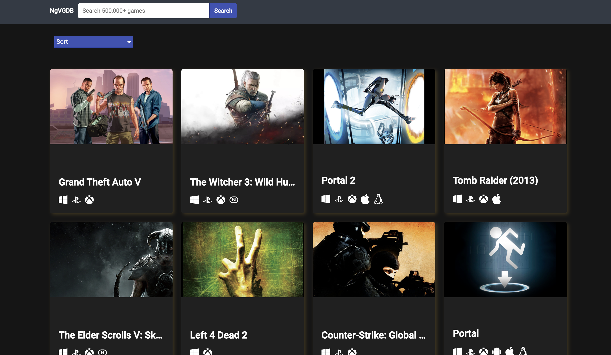
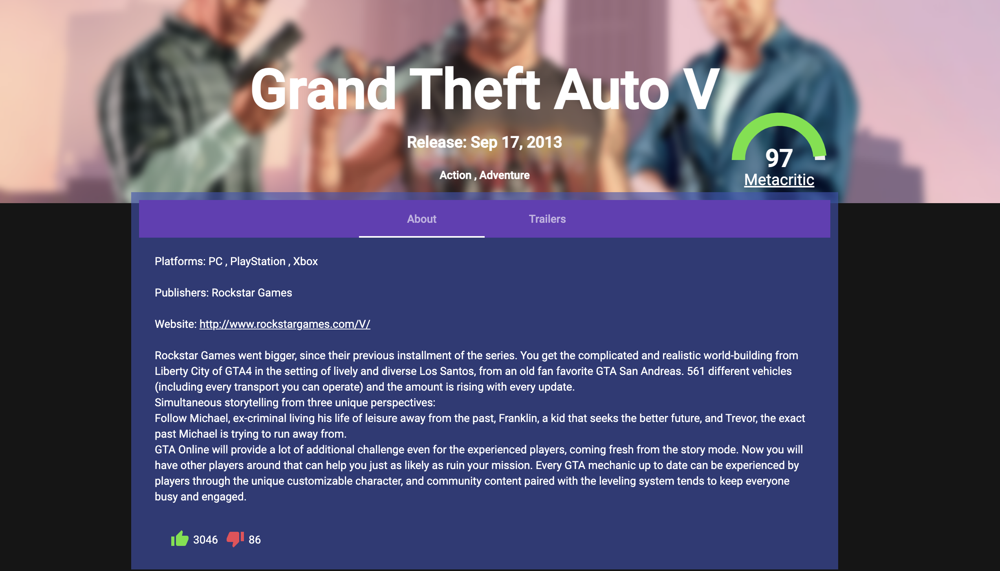

# NgVideoGameDb

Ng Video Game is a db platform built with Angular. I have implemented:
- RAWG API
- Filters
- Loops 
- Conditions
- Subscriptions
- Http Services
- Etc...

## Development server

Run `ng serve` for a dev server. Navigate to `http://localhost:4200/`. The app will automatically reload if you change any of the source files.

## Screenshots

